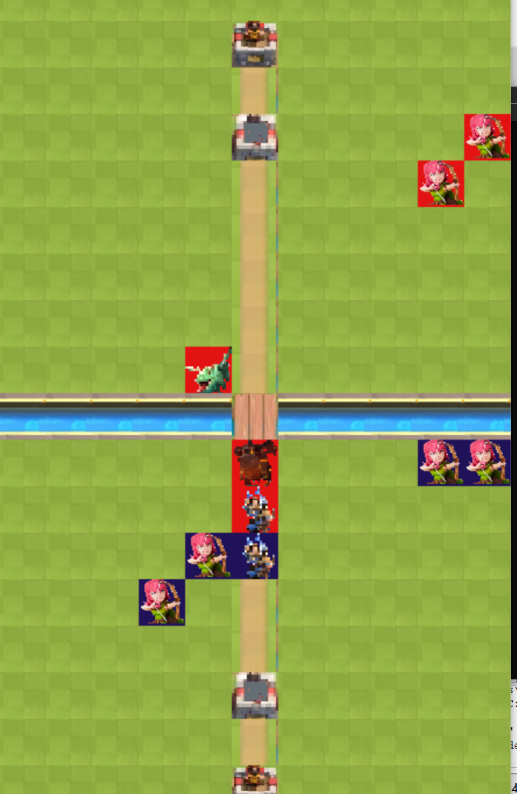

# clash-royal-game
## Un petit jeu programmé en C

### a little description of the game

We are going to create a very simplified version of a mobile phone game called "Clash Royale" by SuperCell.  
The game consists of seeing your units advance towards the enemy camp and when they are within range of an enemy unit, they engage in combat.  
You can find many videos on YouTube to give you an idea of the basic game "Clash Royale". The game ends when the king's tower of one of the players is destroyed.  
Our game will be automatic (computer vs computer).

For more informations, on the game, you can consult 

